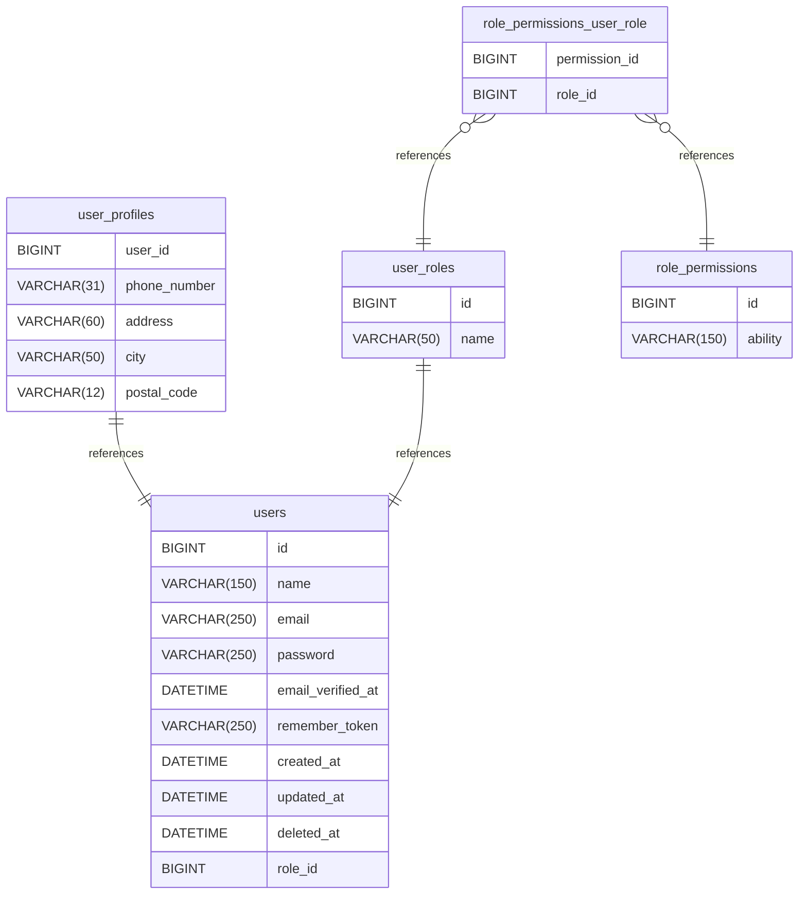

# tcms-v1 documentation
## Summary

- [Introduction](#introduction)
- [Database Type](#database-type)
- [Table Structure](#table-structure)
	- [users](#users)
	- [user_profiles](#user_profiles)
	- [user_roles](#user_roles)
	- [role_permissions](#role_permissions)
	- [role_permissions_user_role](#role_permissions_user_role)
- [Relationships](#relationships)
- [Database Diagram](#database-Diagram)

## Introduction

## Database type

- **Database system:** MariaDB
## Table structure

### users

| Name        | Type          | Settings                      | References                    | Note                           |
|-------------|---------------|-------------------------------|-------------------------------|--------------------------------|
| **id** | BIGINT | 🔑 PK, not null , unique, autoincrement |  | |
| **name** | VARCHAR(150) | not null  |  | |
| **email** | VARCHAR(250) | not null , unique |  | |
| **password** | VARCHAR(250) | not null  |  | |
| **email_verified_at** | DATETIME | not null  |  | |
| **remember_token** | VARCHAR(250) | not null  |  | |
| **created_at** | DATETIME | not null  |  | |
| **updated_at** | DATETIME | not null  |  | |
| **deleted_at** | DATETIME | not null  |  | |
| **role_id** | BIGINT | not null  |  | | 

#### Indexes
| Name | Unique | Fields |
|------|--------|--------|
| users_index_0 |  | id |
| users_index_1 |  | email |
### user_profiles

| Name        | Type          | Settings                      | References                    | Note                           |
|-------------|---------------|-------------------------------|-------------------------------|--------------------------------|
| **user_id** | BIGINT | 🔑 PK, not null , unique | profiles_user_id_fk | |
| **phone_number** | VARCHAR(31) | not null  |  | |
| **address** | VARCHAR(60) | not null  |  | |
| **city** | VARCHAR(50) | not null  |  | |
| **postal_code** | VARCHAR(12) | not null  |  | | 

#### Indexes
| Name | Unique | Fields |
|------|--------|--------|
| profiles_index_0 |  | user_id |
### user_roles

| Name        | Type          | Settings                      | References                    | Note                           |
|-------------|---------------|-------------------------------|-------------------------------|--------------------------------|
| **id** | BIGINT | 🔑 PK, not null , unique, autoincrement | roles_id_fk | |
| **name** | VARCHAR(50) | not null , unique |  | | 

#### Indexes
| Name | Unique | Fields |
|------|--------|--------|
| roles_2_index_0 |  | id |
| roles_2_index_1 |  | name |
### role_permissions

| Name        | Type          | Settings                      | References                    | Note                           |
|-------------|---------------|-------------------------------|-------------------------------|--------------------------------|
| **id** | BIGINT | 🔑 PK, not null , unique, autoincrement |  | |
| **ability** | VARCHAR(150) | not null , unique |  | | 

#### Indexes
| Name | Unique | Fields |
|------|--------|--------|
| abilities_index_0 |  | id |
### role_permissions_user_role

| Name        | Type          | Settings                      | References                    | Note                           |
|-------------|---------------|-------------------------------|-------------------------------|--------------------------------|
| **permission_id** | BIGINT | 🔑 PK, not null  | ability_role_ability_id_fk | |
| **role_id** | BIGINT | 🔑 PK, not null  | ability_role_role_id_fk | | 

#### Indexes
| Name | Unique | Fields |
|------|--------|--------|
| ability_role_index_0 |  | ability_id |
| ability_role_index_1 |  | role_id |
## Relationships

- **user_profiles to users**: one_to_one
- **user_roles to users**: one_to_one
- **role_permissions_user_role to role_permissions**: one_to_many
- **role_permissions_user_role to user_roles**: one_to_many

## Database Diagram

